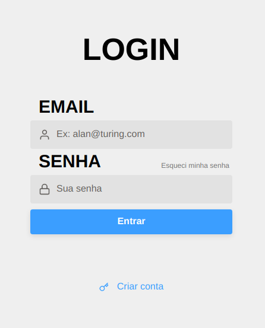
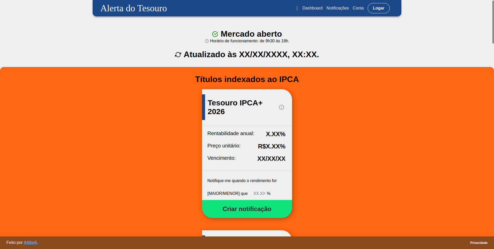

<h1 align="center">
    <!-- 
    <br/
    > -->
    🚨 Alerta do Tesouro (WIP)
</h1>

<h4 align="center">
A web application that notifies you about Brazilian treasury bond rates.
</h4>

<p align="center">
  <a href="#-project">Project</a>&nbsp;&nbsp;&nbsp;|&nbsp;&nbsp;&nbsp;
  <a href="#-tools">Tools</a>&nbsp;&nbsp;&nbsp;|&nbsp;&nbsp;&nbsp;
  <a href="#-back-end">Back-end</a>&nbsp;&nbsp;&nbsp;|&nbsp;&nbsp;&nbsp;
  <a href="#-running-locally">Running locally</a>
</p>

<p align="center">
  
  
</p>

# 💻 Project

AlertaDoTesouro is a project elaborated with the intent of automatically monitoring Brazilian government bonds and alerting users about them. Tool such as Node.js, Express, PostgreSQL, Docker, Redis, linting and debugging tools, mail delivery systems, etc were employed to achieved this.

The application allows users to set one value per treasury bond so they can get notified whenever its rate goes above or below that value. Users can get notified by email or browser notifications and notifications are fully configurable.

<!--
<table>
    <thead>
        <tr>
          <th>Sign in</th>
          <th>Dashboard</th>
          <th>Profile</th>
        </tr>
    </thead>
    <tbody>
        <tr>
            <td><a target="_blank" href=".github/sign_in.png"></td>
            <td><a target="_blank" href=".github/dashboard.png"></td>
            <td><a target="_blank" href=".github/profile.png"></td>
        </tr>
    </tbody>
</table>
-->

## 🔧 Tools

This project was developed using the following tools:

- [Node.js](https://nodejs.org/en/)
- [Express](https://expressjs.com/)
- [React.js](http://reactjs.org/)
- [PostgreSQL](https://www.postgresql.org/)
- [Docker](https://www.docker.com/)

## ⚙️ Back-end

The back-end REST API was made with Express. Multiple endpoints have been defined and you can test them extensively by referring to the file `.insomnia.json` file, which can be imported into [Insomnia](https://insomnia.rest/) itself or possibly other REST clients.

### Example: listing treasury bonds

A typical request would be a simple `GET` request to the `/treasurybonds` endpoint. Response example:

```bash
[
  {
    "id": "233b7ab7-63dd-4a06-ab21-8fd2562069e5",
    "code": 162,
    "name": "Tesouro Prefixado com Juros Semestrais 2029",
    "expirationDate": "2029-01-01T03:00:00.000Z",
    "minimumInvestmentAmount": 0,
    "investmentUnitaryValue": 0,
    "semianualInterestIndex": true,
    "annualInvestmentRate": 0,
    "annualRedRate": 7.13,
    "minimumRedValue": 11.92,
    "ISIN": "BRSTNCNTF1Q6",
    "indexedTo": {
      "code": 19,
      "name": 19
    },
    "lastDateOfNegotiation": "2020-02-10T03:00:00.000Z",
    "texts": {
      "investmentSubtitle": "É mais interessante para quem precisa dos seus rendimentos para complementar sua renda, pois paga juros a cada semestre (cupons de juros). Em caso de resgate antecipado, o Tesouro Nacional garante sua recompra pelo seu valor de mercado.",
      "features": 162,
      "recommendedTo": "Indicado para aqueles que querem realizar investimentos de longo prazo."
    },
    "created_at": "2020-08-23T22:46:56.763Z",
    "updated_at": "2020-08-23T22:46:56.763Z"
  },
  [...]
]
```

# 🏡 Running locally

## Back-end

1. Clone the repository and enter the folder with your terminal. Then, install all back-end dependencies by executing `npm install` or `yarn`.

2. You'll need to run Postgres for the database and Redis for queues/background jobs. If you already have Docker correctly installed on your system, you can create containers for these two applications with the following commands:

   ```bash
   sudo docker run --name AlertaDoTesouro-postgres -e POSTGRES_USER=alertadotesouro POSTGRES_PASSWORD=your_postgres_password -p 5433:5432 -d postgres

   sudo docker run --name AlertaDoTesouro-redis -p 6379:6379 -d -t redis:alpine
   ```

   You'll be able to start the containers afterwards with `yarn up`.

3. Rename the `.env.example` file to `.env`. You can change some values if you want, just keep it consistent throughout the application. Some notes:

   - The default port is 3333. You might want to change this if this port is already where you're running the application.
   - You could change JWT_SECRET to another string you desire. It is used by the hashing algorithm for the passwords.
   <!-- - [Sentry](https://sentry.io/for/web/) was added mostly for learning purposes and of course is not required; feel free to leave the string empty. -->

4. To run migrations with TypeORM, run the following command in the root directory:

   ```bash
   yarn typeorm migration:run
   ```

5. Start the queue with `yarn dev:queue`.
6. Start the server with `yarn dev:server`.

## Front-end

1. Access the `web/` directory with your terminal. Install all front-end dependencies with `npm install` or `yarn`.

2. Start the front-end application with `yarn start`. Default port is 3000.
