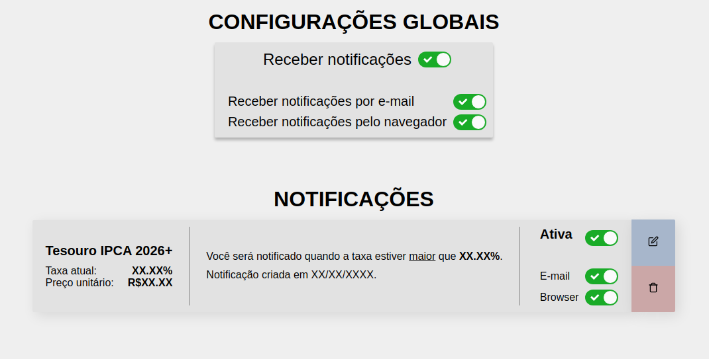

<h1 align="center">
    🚨 Alerta do Tesouro (WIP)
</h1>

<h4 align="center">
A web application that notifies you about Brazilian treasury bond rates.
</h4>

<p align="center">
  <a href="#-project">Project</a>&nbsp;&nbsp;&nbsp;|&nbsp;&nbsp;&nbsp;
  <a href="#-tools">Tools</a>&nbsp;&nbsp;&nbsp;|&nbsp;&nbsp;&nbsp;
  <a href="#-tools">Developing</a>&nbsp;&nbsp;&nbsp;|&nbsp;&nbsp;&nbsp;
  <a href="#-back-end">Back-end</a>&nbsp;&nbsp;&nbsp;|&nbsp;&nbsp;&nbsp;
  <a href="#-running-locally">Running locally</a>
</p>

<p align="center">
  <a href="./LICENSE">
    
  </a>
</p>

# 💻 Project

AlertaDoTesouro is a project elaborated with the intent of automatically monitoring Brazilian government bond and alerting users about them according to their preferences of rates. Tools such as Node.js, Express, PostgreSQL, Docker, Redis, linting and debugging tools, mail delivery systems, among others, were employed to build this system.
Furthermore, this project was also presented as required academic work for the Integrated Project classes during the 2022/1 semester.

The application allows users to set one value per treasury bond, so they can get notified whenever its rate goes above or below that value. Users should be able to be notified by email or browser notifications.

<table>
    <thead>
        <tr>
          <th>Dashboard</th>
          <th>Sign in</th>
          <th>Notifications</th>
        </tr>
    </thead>
    <tbody>
        <tr>
            <td><a target="_blank" href=".github/dashboard.png"></td>
            <td><a target="_blank" href=".github/sign_in.png"></td>
            <td><a target="_blank" href=".github/notifications.png"></td>
        </tr>
    </tbody>
</table>

## 🔧 Tools

This project was developed using the following tools:

- [Node.js](https://nodejs.org/en/)
- [Express](https://expressjs.com/)
- [React.js](http://reactjs.org/)
- [PostgreSQL](https://www.postgresql.org/)
- [Docker](https://www.docker.com/) with [Compose __V2__](https://docs.docker.com/compose/#compose-v2-and-the-new-docker-compose-command)

## 👷 Development

Clone the repository and enter it with your terminal.

Rename or copy the `.env.test.example` file to `.env.test` in `/server` and change values whenever needed.
To run the development servers, run the following command:

```sh
docker compose --profile dev up
```

### ⚙️ Back-end

All files exclusively related to the back-end server are located in the folder `/server`.

The back-end REST API is fully functional and was made with Express. Multiple endpoints have been defined and they can be explored extensively by referring to the `.insomnia.json` file, which can be imported into [Insomnia](https://insomnia.rest/) itself or possibly other HTTP clients.

#### 🧪 Testing

Deploy the test database with the following command:

```sh
docker compose --profile dev --profile test up
```

> When you need to wipe the volumes, just `docker compose --profile dev --profile test down --volumes`

Once running, you can unit test and integration test the back-end server by running the following command:

```sh
docker exec -t alertadotesouro-server-dev-1 yarn test
```

#### Example: listing treasury bond

A typical request would be a simple `GET` request to the `/treasurybond` endpoint. Response example:

```bash
[
  {
    "id": "233b7ab7-63dd-4a06-ab21-8fd2562069e5",
    "code": 162,
    "name": "Tesouro Prefixado com Juros Semestrais 2029",
    "expirationDate": "2029-01-01T03:00:00.000Z",
    "minimumInvestmentAmount": 0,
    "investmentUnitaryValue": 0,
    "semianualInterestIndex": true,
    "annualInvestmentRate": 0,
    "annualRedRate": 7.13,
    "minimumRedValue": 11.92,
    "ISIN": "BRSTNCNTF1Q6",
    "indexedTo": {
      "code": 19,
      "name": 19
    },
    "lastDateOfNegotiation": "2020-02-10T03:00:00.000Z",
    "texts": {
      "investmentSubtitle": "É mais interessante para quem precisa dos seus rendimentos para complementar sua renda, pois paga juros a cada semestre (cupons de juros). Em caso de resgate antecipado, o Tesouro Nacional garante sua recompra pelo seu valor de mercado.",
      "features": 162,
      "recommendedTo": "Indicado para aqueles que querem realizar investimentos de longo prazo."
    },
    "created_at": "2020-08-23T22:46:56.763Z",
    "updated_at": "2020-08-23T22:46:56.763Z"
  },
  [...]
]
```

#### 📑 Documentation

You can build the documentation with [typedoc](https://typedoc.org/). It is recommended that you install `typedoc` with tools like [npx](https://docs.npmjs.com/cli/v7/commands/npx/).

From the `/server` directory, run `typedoc --out docs`. The documentation will then be available at `docs/`.

### 🖥 Front-end

Running it with `dev` profile (see below) will automatically start the front-end server and you will have access to debugging logs on the browser console.

## 🏡 Running locally

Clone the repository and enter the folder with your terminal. To start the services with Compose v2, run the following command while on the project root directory:

```bash
docker compose up # TODO, only development is currently supported
```

> You can append `-d` or `--detach` to run the services in detached mode.

Rename or copy the `.env.example` file to `.env` in both the `/server` and `/web` directories and change values whenever needed.

### 🤓 Back-end considerations

- The default server port is `3333`. You might want to change this if this port is already in use wherever you are running the server on.
- You can and __should__ change `JWT_SECRET` to another string. It is used by the hashing algorithm to generate hashed passwords.
- The project uses Mailtrap for development purposes. You can of course use your preferred mail service by replacing the appropriate values in the `.env` file.
   <!-- - [Sentry](https://sentry.io/for/web/) was added mostly for learning purposes and of course is not required; feel free to leave the string empty. -->

### 🤓 Front-end considerations

- The default port is `3000`. You might want to change this if this port is already in use wherever you are running the server on.
